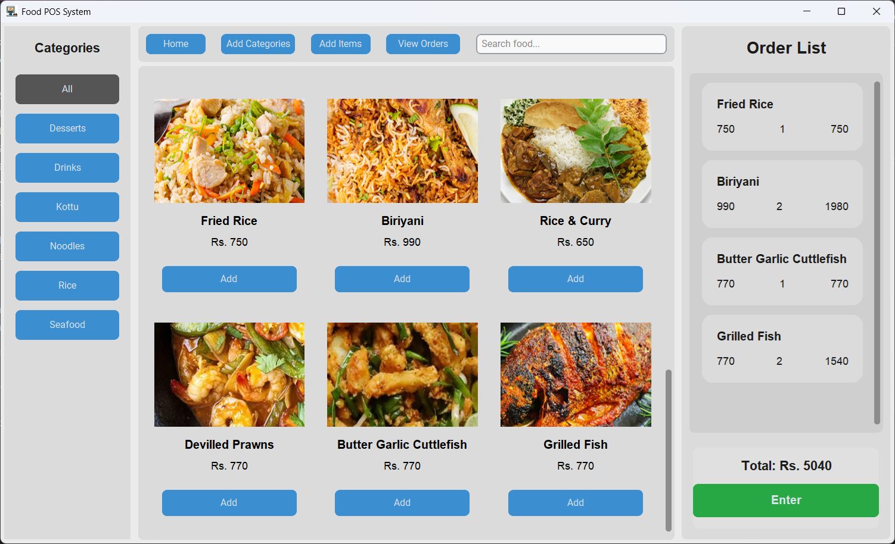

# 🍔 Food POS System

A modern, desktop-based Point of Sale (POS) application built with Python using CustomTkinter. This system allows users to manage food categories, products, and process orders through a clean, responsive interface.


# ✨ Features

Dynamic Grid: Browse food items with high-quality images and clear pricing.

Search & Filter: Find items instantly by name or filter by specific categories.

Interactive Cart: Add items, adjust quantities, and view live total calculations.

Order Completion: Automatically clears the list for the next customer after saving to the database.


# 📂 Project Structure
```
├── __pycache__/
├── assets/
│
├── db.py
├── main.py
└── README.md
```

# 🛠 Technologies Used

- Python 3  
- CustomTkinter  
- MySQL  
- Pillow (PIL)


# 📂 Database Structure

### **categories**
| Column | Type | Description |
| :--- | :--- | :--- |
| id | Integer | Primary Key |
| name | Text | Name of the category |

### **products**
| Column | Type | Description |
| :--- | :--- | :--- |
| id | Integer | Primary Key |
| name | Text | Name of the food item |
| price | Decimal | Unit price of the item |
| image_path | Text | Filename or path to the asset image |
| category_id | Integer | Foreign Key (References categories.id) |

### **orders**
| Column | Type | Description |
| :--- | :--- | :--- |
| id | Integer | Primary Key |
| order_date | Timestamp | Date and time the order was placed |
| total_amount | Decimal | Final total price of the order |

### **order_items**
| Column | Type | Description |
| :--- | :--- | :--- |
| id | Integer | Primary Key |
| order_id | Integer | Foreign Key (References orders.id) |
| product_name | Text | Snapshot of the product name at time of purchase |
| quantity | Integer | Number of units purchased |
| price_per_unit| Decimal | Price of the item at time of purchase |
| subtotal | Decimal | Calculated as quantity * price_per_unit |

# 📂 Screen Shots

---


   
